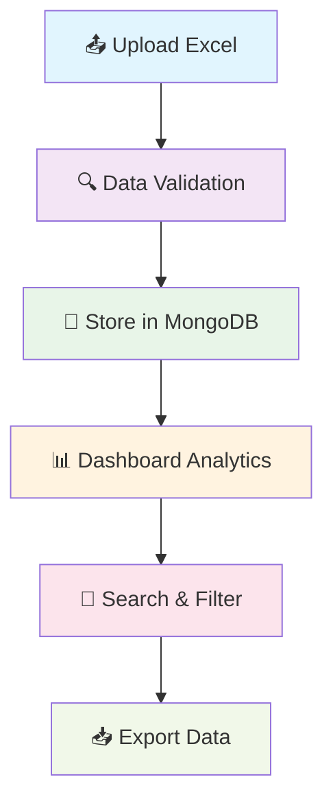
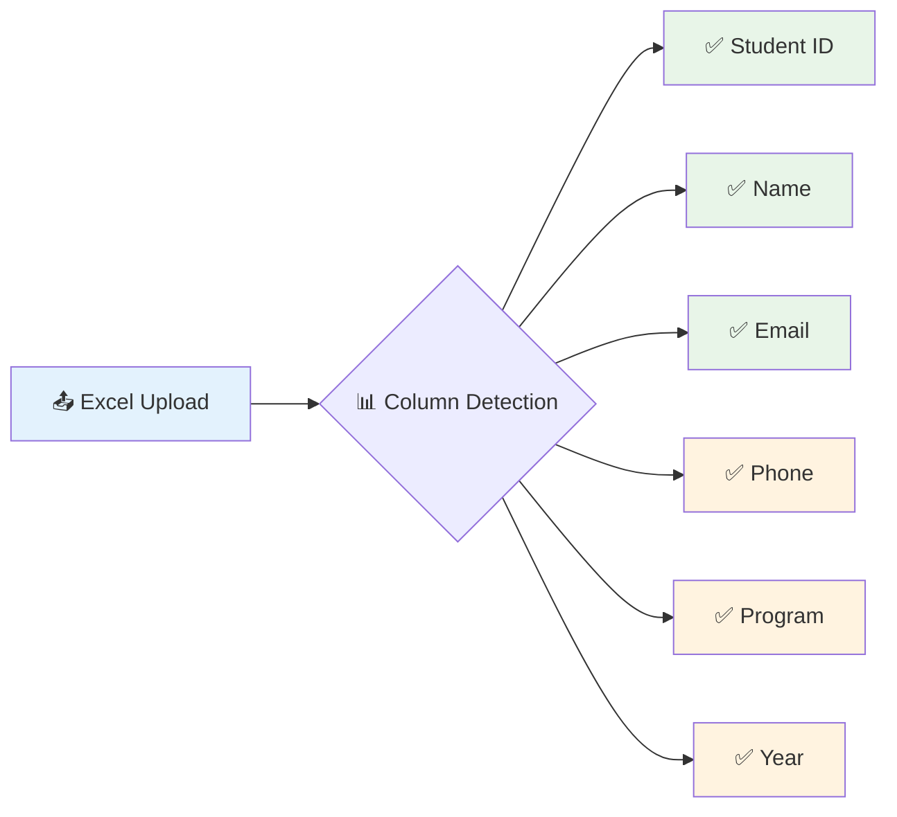

<div align="center">

<!-- Animated Logo -->
<picture>
  <source media="(prefers-color-scheme: dark)" srcset="https://readme-typing-svg.herokuapp.com?font=Fira+Code&size=40&duration=3000&pause=1000&color=3B82F6&center=true&vCenter=true&width=600&height=80&lines=CampusLens+📚;Student+Data+Management;Made+with+💖+by+Anuj">
  
</picture>

<!-- Animated description -->
<p align="center">
  
</p>

<!-- Animated badges -->
<p align="center">
  
  
  
  
</p>

<!-- Wavy separator -->
<picture>
  <source media="(prefers-color-scheme: dark)" srcset="https://raw.githubusercontent.com/platane/platane/output/github-contribution-grid-snake-dark.svg">
  
</picture>

<!-- Social links with animated buttons -->
<p align="center">
  <a href="https://www.linkedin.com/in/anujshrivastava1/">
    
  </a>
  <a href="https://github.com/AnujShrivastava01">
    
  </a>
</p>

</div>

---

## 🚨 **Environment Setup**

<details>
<summary>📋 <strong>Click to expand setup instructions</strong></summary>

### **Backend Environment Variables**
```bash
# Create backend/.env file
MONGODB_URI=your_mongodb_connection_string
CLERK_SECRET_KEY=your_clerk_secret_key
PORT=5000
NODE_ENV=development
CLIENT_URL=http://localhost:5173
```

### **Frontend Environment Variables**
```bash
# Create frontend/.env file
VITE_CLERK_PUBLISHABLE_KEY=your_clerk_publishable_key
VITE_API_URL=http://localhost:5000/api
```

⚠️ **Never commit `.env` files to Git!** They contain sensitive credentials.

</details>

## ✨ **Features**

<div align="center">

<!-- Features grid with animated icons -->
| 🔐 **Authentication** | 📊 **Data Management** | 📁 **File Operations** | 🎨 **Modern UI/UX** |
|:---:|:---:|:---:|:---:|
| Clerk Auth Integration | Excel Data Processing | Upload & Download | Glassmorphism Design |
| Secure User Sessions | Real-time Filtering | Template Generation | Smooth Animations |
| Protected Routes | Advanced Search | Bulk Operations | Responsive Design |

</div>

### 🎯 **Core Functionality**



---

## 🏗️ **Project Architecture**

<div align="center">

```
📁 CampusLens Fullstack
├── 🎨 Frontend (React + TypeScript + Vite)
│   ├── 🧩 Components (Shadcn/UI + Custom)
│   ├── 📱 Pages (Dashboard, Students, Files)
│   ├── 🔌 Services (API Integration)
│   └── 🎭 Assets (Icons, Images)
│
└── ⚙️ Backend (Node.js + Express + MongoDB)
    ├── 🛣️ Routes (Students, Upload, Auth)
    ├── 📋 Models (Student, FileUpload)
    ├── 🔒 Middleware (Auth, CORS, Security)
    └── 📊 Utils (Excel Processing, Validation)
```

</div>

## 🚀 **Quick Start**

<div align="center">

<!-- Animated installation steps -->
```bash
# 1️⃣ Clone the repository
git clone https://github.com/AnujShrivastava01/CampusLens2.git
cd campuslens-fullstack

# 2️⃣ Install dependencies
npm run install:all

# 3️⃣ Setup environment files
cp backend/.env.example backend/.env
cp frontend/.env.example frontend/.env

# 4️⃣ Start development servers
npm run dev
```

</div>

### 📋 **Prerequisites**
<details>
<summary>🔧 <strong>System Requirements</strong></summary>

- **Node.js** `v18.0.0+` 
- **npm** `v8.0.0+` or **yarn** `v1.22.0+`
- **MongoDB** (Atlas or local installation)
- **Git** for version control

</details>

### 🔧 **Development Setup**

<table>
<tr>
<td>

**🖥️ Backend Setup**
```bash
cd backend
npm install
npm run dev
```
*Server runs on port 5000*

</td>
<td>

**🌐 Frontend Setup**  
```bash
cd frontend
npm install
npm run dev
```
*App runs on port 5173*

</td>
</tr>
</table>

## 🗄️ **Database Setup**

### 🌟 **MongoDB Atlas (Recommended)**

<details>
<summary>☁️ <strong>Cloud Setup Instructions</strong></summary>

1. **Create Account** → [MongoDB Atlas](https://www.mongodb.com/atlas)
2. **Create Cluster** → Choose free tier (M0 Sandbox)
3. **Database User** → Create username/password
4. **Network Access** → Add `0.0.0.0/0` for development
5. **Connection String** → Copy and update `.env`

```bash
MONGODB_URI=mongodb+srv://<username>:<password>@cluster.mongodb.net/campuslens?retryWrites=true&w=majority
```

</details>

### 🏠 **Local MongoDB**

<details>
<summary>💻 <strong>Local Installation</strong></summary>

```bash
# Install MongoDB Community Server
# Windows: Download from official website
# macOS: brew install mongodb-community
# Linux: sudo apt-get install mongodb

# Start MongoDB service
mongod --dbpath /path/to/data/directory

# Connection string for local
MONGODB_URI=mongodb://localhost:27017/campuslens
```

</details>

---

## 🔧 **API Documentation**

<div align="center">

### 🎯 **Endpoints Overview**

| Method | Endpoint | Description | Auth Required |
|:---:|:---:|:---:|:---:|
| 🟢 GET | `/api/students` | Fetch all students with filters | ✅ |
| 🟡 POST | `/api/upload/excel` | Upload Excel file | ✅ |
| 🔵 GET | `/api/upload/template` | Download Excel template | ❌ |
| 🟠 DELETE | `/api/students/:id` | Delete student record | ✅ |

</div>

### 📊 **Student Management**
```javascript
// Get students with filtering
GET /api/students?page=1&limit=10&search=john&program=CSE

// Response format
{
  "success": true,
  "data": {
    "students": [...],
    "pagination": {
      "page": 1,
      "limit": 10,
      "total": 100,
      "pages": 10
    }
  }
}
```

### 📁 **File Operations**
```javascript
// Upload Excel file
POST /api/upload/excel
Content-Type: multipart/form-data

// Response format
{
  "success": true,
  "message": "File processed successfully",
  "stats": {
    "total": 50,
    "successful": 48,
    "failed": 2
  }
}
```

## 📊 **Excel Integration**

<div align="center">

### 📋 **Supported Excel Columns**



</div>

| Column | Required | Format | Example |
|:---:|:---:|:---:|:---:|
| 🆔 Student ID | ✅ | Text/Number | `STU001`, `2021001` |
| 👤 Name | ✅ | Text | `John Doe` |
| 📧 Email | ✅ | Email Format | `john@example.com` |
| 📱 Phone | ⚪ | Text/Number | `+1234567890` |
| 🎓 Program | ✅ | Text | `Computer Science` |
| 📅 Year | ⚪ | Number | `1`, `2`, `3`, `4` |

### 🔄 **Upload Process**

<details>
<summary>📝 <strong>Step-by-step Guide</strong></summary>

1. **📥 Download Template** → Get from `/api/upload/template`
2. **✏️ Fill Data** → Add student information
3. **📤 Upload File** → Via dashboard interface
4. **🔍 Validation** → System checks data integrity
5. **✅ Confirmation** → Review and confirm import
6. **📊 Analytics** → View imported data statistics

</details>

---

## 🚀 **Deployment**

### 🌐 **Frontend (Vercel/Netlify)**

<div align="center">

[](https://vercel.com/new/clone?repository-url=https://github.com/AnujShrivastava01/CampusLens2/tree/main/frontend)
[](https://app.netlify.com/start/deploy?repository=https://github.com/AnujShrivastava01/CampusLens2)

</div>

```bash
# Build frontend
cd frontend
npm run build

# Deploy dist folder to your hosting service
# Set environment variables in hosting dashboard
```

### ⚙️ **Backend (Railway/Render)**

<div align="center">

[](https://railway.app/new/template/template_id)

</div>

```bash
# Deploy backend folder to hosting service
# Set environment variables:
MONGODB_URI=your_connection_string
NODE_ENV=production
CLIENT_URL=https://your-frontend-domain.com
CLERK_SECRET_KEY=your_clerk_secret
```

## 🛠️ **Tech Stack**

<div align="center">

### 🎨 **Frontend Technologies**

<table>
<tr>
<td align="center"><br><b>React 18</b></td>
<td align="center"><br><b>TypeScript</b></td>
<td align="center"><br><b>Vite</b></td>
<td align="center"><br><b>Tailwind CSS</b></td>
</tr>
<tr>
<td align="center"><br><b>Framer Motion</b></td>
<td align="center"><br><b>Shadcn/UI</b></td>
<td align="center"><br><b>Clerk Auth</b></td>
<td align="center"><br><b>React Query</b></td>
</tr>
</table>

### ⚙️ **Backend Technologies**

<table>
<tr>
<td align="center"><br><b>Node.js</b></td>
<td align="center"><br><b>Express.js</b></td>
<td align="center"><br><b>MongoDB</b></td>
<td align="center"><br><b>Mongoose</b></td>
</tr>
</table>

### 🔧 **Development Tools**

| Tool | Purpose | Version |
|:---:|:---:|:---:|
| 📊 **XLSX** | Excel Processing | `^0.18.5` |
| 🔒 **Helmet** | Security Headers | `^7.1.0` |
| 📁 **Multer** | File Uploads | `^1.4.5` |
| ✅ **Joi** | Data Validation | `^17.11.0` |

</div>

---

## 📈 **Performance & Features**

<div align="center">

### ⚡ **Performance Metrics**

```bash
� Lighthouse Score: 95+
🚀 First Load: < 2s
💾 Bundle Size: < 500KB gzipped
📱 Mobile Responsive: 100%
🔒 Security Score: A+
```

### 🎯 **Key Features**

- ✅ **Real-time Search** - Instant filtering across all data
- ✅ **Bulk Operations** - Upload thousands of records
- ✅ **Data Validation** - Comprehensive error checking
- ✅ **Export Functionality** - Download processed data
- ✅ **Mobile Responsive** - Works on all devices
- ✅ **Dark/Light Mode** - Theme switching support

</div>

---

## 🤝 **Contributing**

<div align="center">

### 🚀 **Get Involved**


</div>

<details>
<summary>📋 <strong>Contribution Guidelines</strong></summary>

1. **🍴 Fork** the repository
2. **🌿 Create** a feature branch (`git checkout -b feature/amazing-feature`)
3. **✨ Commit** your changes (`git commit -m 'Add amazing feature'`)
4. **🚀 Push** to the branch (`git push origin feature/amazing-feature`)
5. **📋 Open** a Pull Request

### 🐛 **Bug Reports**
- Use GitHub Issues
- Include steps to reproduce
- Provide screenshots if applicable

### 💡 **Feature Requests**
- Describe the feature in detail
- Explain the use case
- Consider implementation complexity

</details>

---

## 📞 **Support & Contact**

<div align="center">

### 💖 **Made with Love by Anuj**

<p>
  <a href="https://www.linkedin.com/in/anujshrivastava1/">
    
  </a>
  <a href="https://github.com/AnujShrivastava01">
    
  </a>
</p>

### 📧 **Get Help**

- 🐛 **Bug Reports**: [Create an Issue](https://github.com/AnujShrivastava01/CampusLens2/issues)
- 💬 **Discussions**: [GitHub Discussions](https://github.com/AnujShrivastava01/CampusLens2/discussions)
- 📖 **Documentation**: [Wiki](https://github.com/AnujShrivastava01/CampusLens2/wiki)

</div>

---

## 📝 **License**

<div align="center">

```
MIT License - Free to use, modify, and distribute
```


**© 2025 Anuj Shrivastava. Built with 💖 for the education community.**

</div>

---

<div align="center">

### 🌟 **Star this project if you found it helpful!**


**Thank you for checking out CampusLens! 🚀**

</div>
