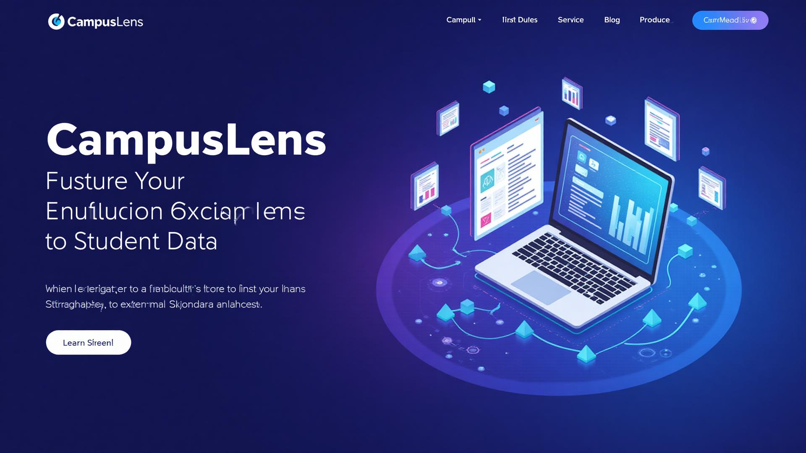

# 🎓 CampusLens - Student Data Management Platform

<div align="center">
  
  
  <p><strong>A modern, full-stack student data management platform with Excel integration</strong></p>
  
  [](https://lovable.dev)
  [](https://reactjs.org)
  [](https://typescriptlang.org)
  [](https://tailwindcss.com)
</div>

## ✨ Features

### 🔐 **Authentication**
- **Google OAuth Integration** - Secure login with Google accounts
- **Protected Routes** - Dashboard access only for authenticated users
- **User Sessions** - Persistent login state management

### 📁 **File Management**
- **Excel Upload** - Support for `.xlsx` and `.csv` files
- **Auto-parsing** - Automatic extraction of student data
- **File History** - Track all uploaded files with metadata
- **Bulk Operations** - Delete entire sheets or individual records

### 📊 **Data Management**
- **Student Records** - Store name, mobile number, and branch
- **Advanced Filtering** - Filter by name, mobile, branch, upload date
- **Real-time Search** - Instant search across all student data
- **Pagination** - Efficient handling of large datasets

### 🎨 **Modern UI/UX**
- **Glassmorphism Design** - Beautiful glass-effect components
- **Dark/Light Mode** - Seamless theme switching
- **Responsive Design** - Perfect on desktop, tablet, and mobile
- **Smooth Animations** - Framer Motion powered transitions
- **Loading States** - Elegant loading spinners and skeletons

## 🚀 Tech Stack

### **Frontend**
- **React 18.3.1** - Modern React with hooks
- **TypeScript** - Type-safe development
- **Vite** - Lightning-fast build tool
- **Tailwind CSS** - Utility-first CSS framework
- **Framer Motion** - Production-ready motion library
- **Shadcn/ui** - Beautiful, accessible components

### **Backend & Database**
- **Supabase** - Open-source Firebase alternative
- **PostgreSQL** - Robust relational database
- **Row Level Security** - Database-level security
- **Real-time Subscriptions** - Live data updates

### **File Processing**
- **XLSX Library** - Excel file parsing
- **CSV Support** - Comma-separated values
- **Data Validation** - Ensure data integrity

## 🛠️ Installation & Setup

### **Prerequisites**
- Node.js 18.0+ and npm
- Git
- Supabase account (free)

### **Quick Start**
```bash
# 1. Clone the repository
git clone https://github.com/your-username/campus-lens.git
cd campus-lens

# 2. Install dependencies
npm install

# 3. Set up environment variables
cp .env.example .env.local

# 4. Start development server
npm run dev
```

### **Environment Variables**
Create a `.env.local` file with:
```env
VITE_SUPABASE_URL=your_supabase_project_url
VITE_SUPABASE_ANON_KEY=your_supabase_anon_key
```

## 🗄️ Database Schema

```sql
-- Students table
CREATE TABLE students (
  id UUID DEFAULT gen_random_uuid() PRIMARY KEY,
  name VARCHAR NOT NULL,
  mobile_number VARCHAR NOT NULL,
  branch VARCHAR NOT NULL,
  sheet_name VARCHAR NOT NULL,
  upload_date TIMESTAMP DEFAULT NOW(),
  uploaded_by UUID REFERENCES auth.users(id),
  created_at TIMESTAMP DEFAULT NOW()
);

-- Uploaded files tracking
CREATE TABLE uploaded_files (
  id UUID DEFAULT gen_random_uuid() PRIMARY KEY,
  filename VARCHAR NOT NULL,
  upload_date TIMESTAMP DEFAULT NOW(),
  uploaded_by UUID REFERENCES auth.users(id),
  student_count INTEGER DEFAULT 0,
  created_at TIMESTAMP DEFAULT NOW()
);
```

## 📱 Pages & Routes

- **`/`** - Landing page with features and CTA
- **`/dashboard`** - Main dashboard with data management
- **`/upload`** - Excel file upload interface (planned)
- **`/profile`** - User profile management (planned)

## 🎨 Design System

CampusLens features a custom design system with:

- **Glassmorphism Effects** - Modern glass-like UI elements
- **Color Palette** - Blue-purple gradient theme
- **Typography** - Clean, readable font system
- **Animations** - Smooth micro-interactions
- **Responsive Grid** - Mobile-first design approach

## 📋 Usage

### **Upload Student Data**
1. Sign in with your Google account
2. Navigate to the Dashboard
3. Click "Upload Excel File"
4. Select your `.xlsx` or `.csv` file
5. Data is automatically parsed and stored

### **Manage Data**
- **Search** - Use the search bar to find specific students
- **Filter** - Filter by branch, upload date, or file
- **Sort** - Sort by any column
- **Delete** - Remove individual records or entire sheets

## 🚀 Deployment

### **Quick Deploy to Vercel**
[](https://vercel.com/new/clone?repository-url=https://github.com/your-username/campus-lens)

### **Manual Deployment**
1. Build the project: `npm run build`
2. Deploy `dist/` folder to your hosting provider
3. Set environment variables in your hosting dashboard

## 🤝 Contributing

We welcome contributions! Please see our [Contributing Guide](CONTRIBUTING.md) for details.

### **Development Workflow**
1. Fork the repository
2. Create a feature branch: `git checkout -b feature/amazing-feature`
3. Commit changes: `git commit -m 'Add amazing feature'`
4. Push to branch: `git push origin feature/amazing-feature`
5. Open a Pull Request

## 📝 License

This project is licensed under the MIT License - see the [LICENSE](LICENSE) file for details.

## 🙏 Acknowledgments

- **Lovable** - For the amazing development platform
- **Supabase** - For the backend infrastructure
- **Shadcn/ui** - For the beautiful component library
- **Framer Motion** - For smooth animations

## 📧 Contact & Support

- **Developer**: Anuj
- **Email**: your-email@domain.com
- **Project URL**: https://lovable.dev/projects/fda04242-b791-4850-8f08-25e8688a52f9

---

<div align="center">
  <p><strong>Made with ❤️ by Anuj</strong></p>
  <p>Built with <a href="https://lovable.dev">Lovable</a></p>
</div>
